[toc]

# WormStudio使用说明书

**@copyright: 小鲸灵(江苏)智能科技**

**@date: 2023/9/13**

**@version: 5.0.0_stable_SDSF**

## 安装

- 下载 wormstudio(版本号).zip 到计算机本地

  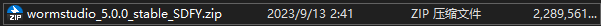

- 将压缩文件移动到某安装路径，建议建议C盘以外的磁盘且内存充足(空余5G以上) 

- 解压到当前路径，等待解压完成，即可完成安装

  

- 到解压生成的wormstudio文件夹下找到wormstudio.exe 即为主运行程序

  

- 右键将wormstudio.exe发送到桌面快捷方式，方便后续使用

  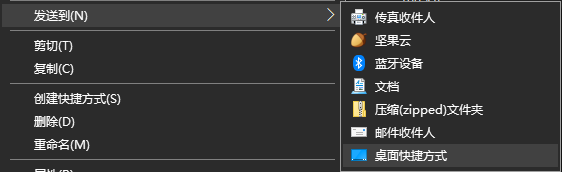

- 测试运行

  在正常情况下，会弹出两个界面。一个黑色的是命令行界面，用于记录细的软件运行信息，另一个是图形界面，用于用户操作

**提示：**

有的电脑在首次运行软件时会先出现黑色命令行界面，然后迟迟不出现图形界面的情况，此时建议耐心等待图形界面出现，如果最终能够出现则没问题

假如出现问题(包括打不开软件，闪退，以及其它不正常的情况)的处理办法是从计算机命令行启动软件，查看具体的出错信息，并将出错信息反馈给工作人员

具体做法为：

- 在windows电脑搜索栏输入cmd ，然后按回车打开命令行黑窗口

- 输入 cd xxx 将路径定位到软件路径(xxx为工作路径)
- 输入wormstudio.exe，按下回车运行
- 截图保存报错信息

## 使用

### 1.文件管理区

文件管理区用于导入，管理和简单查看待处理的视频文件

- 文件管理按钮：加号按钮用于添加**单独一个视频文件**，文件夹按钮用于添加**包含多个视频文件的文件路径**


- 搜索栏：搜索栏用于在文件较多时快速查找所需的文件，提供了输入文本自动补全和下拉功能

  <u>在搜索栏中点击文件名可以将该文件切换为当前文件，显示区也会做出相应变化</u>

  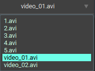

- 管理区：导入后形成的文件菜单栏，<u>可以通过鼠标左键点击来将该文件切换为当前文件，显示区也会做出相应变化</u>，作用和上述搜索栏类似

  

  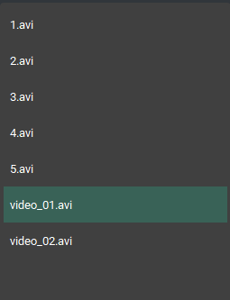

  在管理器中右键某文件项可以出现删除选项，左键确认后从管理区删除该项目

  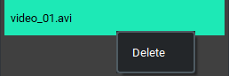

### 2.显示区

显示区用于简单查看待处理的视频文件或视频文件的数据处理结果

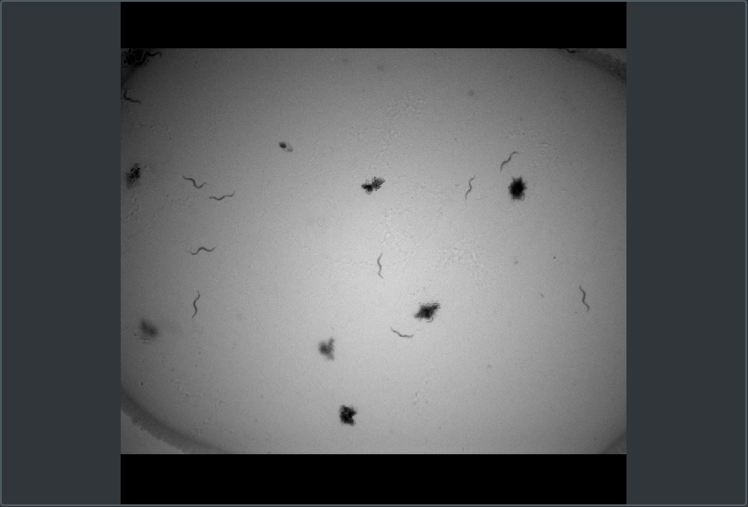

要点提示：

- 显示区只显示“当前文件”的视频预览结果或数据处理结果（“当前文件”由文件管理区选择和控制）

- 在数据处理未完成的情况下，显示区显示<u>视频文件的封面</u>，而在数据处理结束的情况下，显示区显示视频文件中<u>全部目标的运动轨迹图</u>

  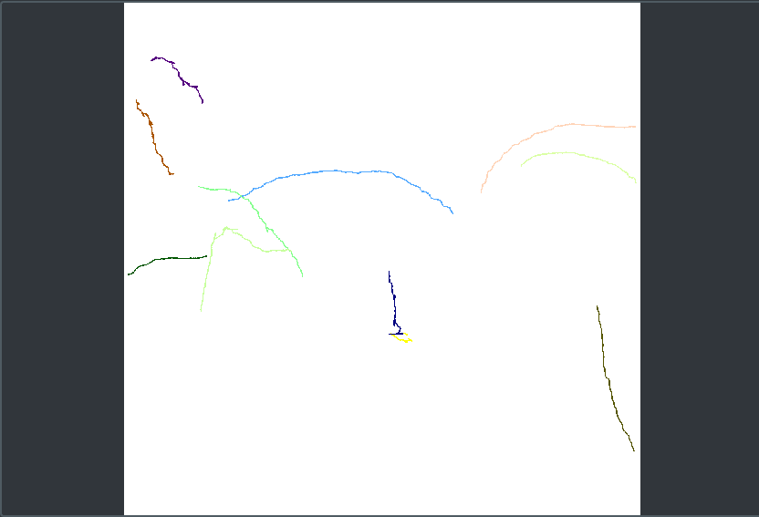

  (**<u>只是为了提醒用户数据处理的进程，详细数据结果应该导出文件后具体查看</u>**)

- 鼠标滚轮可以放大或缩小图片，左键可以拖拽图片，**<u>双击右键复原图片</u>**

### 3.命令设置区

命令设置区用于用户控制开始数据处理进程、导出结果或设置一些关键参数。


- CPU/GPU计算：左起第一个按钮用于控制是否使用GPU(显卡)， 显示为两个风扇的图标时表示使用GPU计算，显示为正方形的芯片表示使用CPU计算，点击完成切换，GPU计算速度更快，但需要硬件支持

- 开启计算控制按钮：中心的按钮点击后开始会开启线程<u>**计算当前文件管理区内的所有文件的数据结果**</u>

- 颜色设置按钮：右侧第一个按钮用于选择绘图颜色，即绘制每个目标的ID、轮廓和轨迹时采用的颜色

  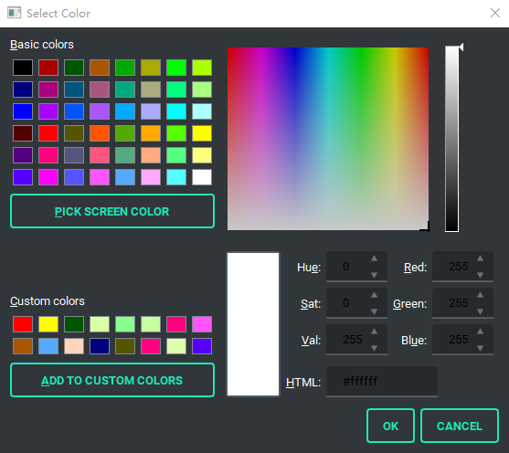

  关于颜色设置，有以下要点：

  - 实际绘图使用的颜色在左下方Custom colors处，总共为16个(若目标数量超过16，则对16的余数取颜色)，次序为：

    | **1** | **3** | **...** |
    | :---: | :---: | :-----: |
    | **2** | **4** | **...** |

  - 左上方为一大批已经设定好的颜色，右上方为全部的颜色，右下方为固定数值，都是为了便于用户取色

  - 希望改变某一绘图颜色的具体方法如下：

    1.点击Custom colors中希望被改变的某一色块

    2.从上述三处取新颜色

    <u>**3.在左下方点击ADD TO CUSTOM COLORS按钮，用新颜色替换原先颜色**</u> (注意不要忘了这一步)

    4.点击OK保存设置

    5.颜色(包括其它参数)设置只会对下一轮计算有效，若计算已经开始或完成则不会影响之前的计算，因此，注意<u>参数设置要在开启计算之前完成</u>

  

- 导出文件按钮：最右侧按钮用于将所有处理结果导出为压缩包。导出文件通过开启线程实现，在文件较多的情况下可能处理时间较久一点，请耐心等待。

## 数据说明

下面对导出数据文件的格式做具体说明：

对于每个输入的视频文件，根据其文件名生成一个子文件夹

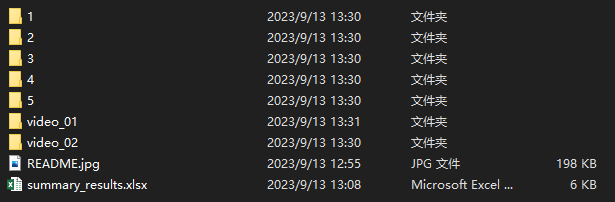

此外还有summary_results.xlsx，包含所有输入视频文件的信息概况


```
VideoName: 视频文件名称
TotalFrames: 视频总帧数
FPS: 视频帧速
Resolution: 视频解析度
AverageSpeed: 视频平均速度(全部目标的速度平均值)
AverageSwing: 视频平均形变率(全部目标的形变率平均值)
```

导出数据文件包含math、visual、cache.txt、cover.png、result.xlsx五个

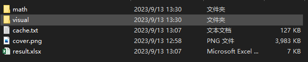

- math文件夹：包含json格式的具体数据文件以及相应指标的绘图

- visual文件夹：包含全部目标轨迹图，可视化视频和每个目标单独的轨迹图

- cache.txt：MOT标准格式的所有目标在每帧的检测信息

- cover.png：视频封面图片

- result.xlsx

  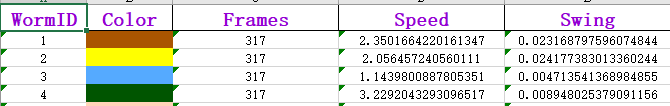

  ```
  WormID：目标ID
  Color：可视化结果中用于绘制该ID的颜色
  Frames：该目标在视频中出现的总帧数
  Speed：目标运动速度
  Swing：目标形变率
  ```

## 计算原理

**下面具体说明一下软件原理，重点分析指标`Speed`和`Swing`的计算依据和方法：**

众所周知，视频是由一个个离散图像组成的，快速播放时形成动态视觉，
$$
video=[f_1,f_2,...,f_n]
$$
其中，第`i`帧为$f_i$，总帧数为$n$

若视频每秒播放帧数(即`FPS`)可知，不难得到视频总帧数$n$，`FPS`和视频时长`t`的关系：
$$
t=\frac{n}{FPS}
$$
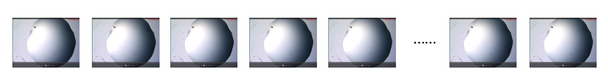

同样众所周知，数值图像实际上是由离散数值矩阵表示的。

其中，矩阵的尺度实际上对应图像的长和宽，矩阵每个位置的数值实际上就是图像在该点的像素值。

为了便于数学表示和计算，对每帧图像建立坐标系，以左上角为原点，向下为x轴，向右为y轴。在该坐标系下，坐标$(x,y)$和矩阵的第x行，第y列元素对应。

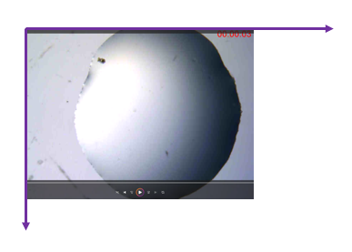

本软件基于深度学习模型，计算得到每帧图像中的目标位置信息。

为了降低复杂度，具体地，可以使用每个目标的最小外接矩形$rectangle$来表征其位置信息：
$$
rectangle = (x,y,w,h)
$$
其中，$x$和$y$表示矩形的中心点坐标，$w$和$h$表示的矩形的长和宽。

因此，使用该图像坐标系下的四个数值，就可以完全描述一个目标的位置信息。

对于所有帧做检测($detection$)。其中，第$i$帧的检测结果为：
$$
det(f_i)=[worm_1(x_1,y_1,w_1,h_1),worm_2(x_2,y_2,w_2,h_2),...]
$$
在存在多目标的情况下，为给不同帧结果中的目标分配唯一标识信息($id$)，采用卡尔曼滤波追踪和匈牙利匹配方法。

得到每个目标的轨迹($trajectory$)信息，即该目标在不同帧中的位置信息：
$$
tra_j=[(t_1,x_1,y_1,w_1,h_1),(t_2,x_2,y_2,w_2,h_2),...(t_n,x_n,y_n,w_n,h_n)]
$$
在实际计算过程中，存在某些特定帧漏检的情况，然而，一个目标从出现在视野中开始，应该保持被连续观测到。

为了保证帧检测的连续性和后续计算的准确，对轨迹信息进行检查和插值修复，以严格保证：
$$
t_{i+1}-t{i}=1
$$
下面给出计算各个指标的具体方法：

- 线速度Speed

  先计算相邻帧的发生的位移，只考虑中心点的欧氏距离，对于$(x_i,y_i)和(x_{i+1},y_{i+1})$：
  $$
  dis_i=\sqrt{(x_{i+1}-x_i)^2+(y_{i+1}-y_i)^2}
  $$
  单位为：像素。

  像素和真实世界距离的换算系数与相机的内外参有关。

  

  某帧瞬时速度为左右相邻位移的平均：
  $$
  v_i=\frac{dis_i+dis_{i+1}}{2}
  $$
  单位为：像素/帧

  帧时间与真实世界时间的换算系数与帧速FPS有关。

  某段时间内的平均速度是该段时间内帧瞬时速度的平均值：
  $$
  v_a=\frac{1}{m-n}\sum_{k=n}^mv_k
  $$
  <u>**Speed指标即为目标在被观测到的全部帧里的中心点平均直线位移速度，单位为像素/帧**</u>，若结合相机内外参和帧速，可以换算为真实世界单位。

- 形变率Swing

  考虑到线虫作为线形状的特殊目标，仅用中心点描述有所欠缺。

  <u>例如，若某线虫保持中心点不动，原地进行扭动或摆动</u>，<u>这也应该是一种典型运动模式，但用中心点描述方法来看，其速度为0，这样就不准确了</u>

  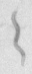

  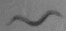

  就像上述两图片的情况。但这时，他们外接矩形的长宽比在发生变化，因此可以用其描述这种“扭动”或“形变”运动。

  因此，我们自定义了“形变率”这一量，定义为：
  $$
  swing = |\frac{w_{i+1}}{h_{i+1}}-\frac{w_i}{h_i}|
  $$
  该量仅描述变化比例，因此无量纲

  形变率的瞬时和平均计算方法和上述线速度相同，加入时间后单位为 /帧

  

## 其它

**小鲸灵(江苏)智能科技 版权所有**

**联系电话：17696554803**

**咨询邮箱：jzy@smail.nju.edu.cn**

有改进需要或其它技术咨询需求，欢迎来电~~